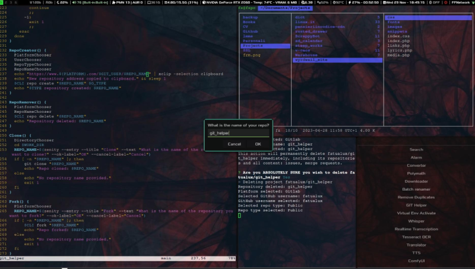

# git_helper

### This is a script I wrote to speed up git related tasks through interactive dialogs.

[](media/demo.mp4)

## GIT_HELPER'S LOGIC

### READMEGenerator()

This function generates a README file based on user input. It prompts the user to choose which sections to include in the README (e.g., Title, Description, Installation, Usage, Dependencies, Contributors, Links, Acknowledgments, License), and then collects the necessary information for each section using Zenity dialogs. It appends the corresponding content to the README file.

### RepoCreator()

This function creates a new repository. It prompts the user to choose a platform (e.g., GitHub, GitLab), enter their username, select a repository type (e.g., public, private), and provide a repository name. It then copies the repository URL to the clipboard, creates the repository using a command-line interface, and displays a success message.

### RepoRemover()

This function deletes an existing repository. It prompts the user to choose a platform and enter the name of the repository they want to delete. It then deletes the repository using a command-line interface and displays a success message.

### Clone()

This function clones a repository to the specified directory. It prompts the user to choose a directory and enter the name of the repository they want to clone. It then uses the `git clone` command to clone the repository and displays a success message.

### Fork()

This function forks an existing repository. It prompts the user to choose a platform and enter the name of the repository they want to fork. It then forks the repository using a command-line interface and displays a success message.

### PRCreator()

This function creates a pull request. It prompts the user to enter the title, description, branch name, and base branch name for the pull request. It then uses the `gh pr create` command to create the pull request and displays a success message.

### Contribute()

This function facilitates contributing to a repository. It prompts the user to choose a directory, enter the name of the repository they want to contribute to, the URL of their forked repository, the branch name, and the commit message. It then adds the official repository as a remote, adds the forked repository as another remote, checks out the branch, adds and commits the changes, and pushes the branch to the forked repository.

### ListActions()

This function is not defined in the provided code.

## INSTALLATION

```
git clone https://gitlab.com/fatualux/git_helper
```

## USAGE

```
cd git_helper/helpers && ./git_helper
```

## DEPENDENCIES

bash git zenity github-cli gitlab-cli xclip

## LICENSE

This project is covered by GPLv3.

(https://img.shields.io/badge/License-GPL%20v3-blue.svg)](http://www.gnu.org/licenses/gpl-3.0)
